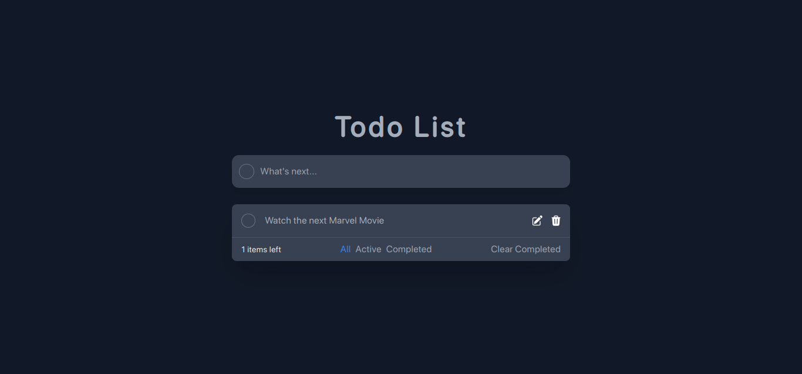

# Todo List App



## Descripción

Esta es una aplicación de lista de tareas simple desarrollada con React y TypeScript. Permite a los usuarios agregar, editar, marcar como completadas y eliminar tareas. También ofrece opciones para filtrar las tareas por estado (activas, completadas o todas) y una función para eliminar todas las tareas completadas.

## Inspiración

Gran parte de este proyecto fue inspirado por el video tutorial de Doni Hernandez en YouTube. Puedes encontrar el video original aquí: [Todo List with React - Doni Hernandez](https://www.youtube.com/watch?v=8GFmoynezyA).

## Características

- Agregar nuevas tareas con un título.
- Marcar tareas como completadas o activas.
- Editar el título de las tareas existentes.
- Eliminar tareas individualmente.
- Filtrar tareas por estado: todas, activas o completadas.
- Eliminar todas las tareas completadas en un solo clic.

## Instalación

1. Clona este repositorio en tu máquina local:

```bash
git clone https://github.com/YeiserDeveloper/TodoList-app
```

2. Navega al directorio del proyecto:

```sh
cd todoList-app
```

3. Instala las dependencias:

```sh
npm install
```

## Uso

1. Inicia la aplicación:

```sh
npm run dev
```


2. Abre tu navegador web y visita [http://localhost:3000](http://localhost:3000) para ver la aplicación.

## Contribuciones

Si deseas contribuir a este proyecto, ¡serán bienvenidas las solicitudes de extracción! Por favor, asegúrate de seguir las pautas de [contribución](CONTRIBUTING.md) y los estándares de código.

## Licencia

Este proyecto está bajo la Licencia MIT - ver el archivo [LICENSE](LICENSE) para más detalles.
